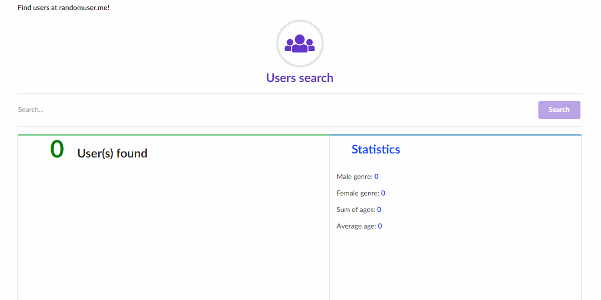

# User search

Imagine the following situation: you already have a gigantic and beautiful user base, with a lot of data about them. All of this
stored in a smart and elegant API.

So you can make a list of them with their pictures and make some basic statistics because... Why not?

Awesome, isn't?

## Page Screen

 
 

## Tech stuff...

- This site was made using only HTML/ CSS and Vanilla Js
- <a href='https://randomuser.me/'>https://randomuser.me/ </a> is the awesome API used to get the list of users used in this project!
- Just double-click in the <strong> index.html </strong> and your browser will do the magic! 
